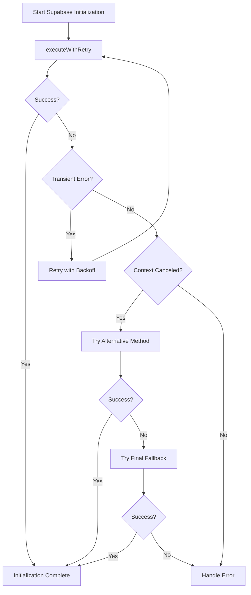

# Documentation Plan: Resolving "Context Canceled" Error in Supabase Initialization

## 1. Introduction and Problem Statement
- Brief overview of the "context canceled" error issue
- Impact on Supabase initialization process
- Root causes identified (process termination, command execution methods, missing error handling, race conditions)
- Importance of addressing this issue for reliable application initialization

## 2. Solution Architecture Overview
- High-level description of the comprehensive solution
- Key components and their interactions
- Flow diagram showing the error handling and retry mechanisms

## 3. Technical Implementation Details

### 3.1 Robust Command Execution with Retry Logic
- Detailed explanation of the `executeWithRetry` function
- Code snippet showing the implementation
- Explanation of key features:
  - Retry logic with exponential backoff
  - Timeout handling using Promise.race
  - Proper stream handling for stdout/stderr
  - Error classification for transient errors

### 3.2 Enhanced Supabase Initialization
- Detailed explanation of the `initializeSupabase` function
- Code snippet showing the implementation
- Explanation of key features:
  - Multiple fallback mechanisms (npx, direct command, execSync)
  - Progressive approach to command execution
  - Detailed logging for debugging

### 3.3 Specialized Error Handling
- Detailed explanation of the error handling approach
- Code snippet showing the `handleProcessError` function
- Explanation of key features:
  - Error type classification
  - User-friendly error messages
  - Guidance on recovery steps

## 4. Testing Methodology

### 4.1 Basic Initialization Testing
- Description of the basic initialization test
- How it verifies the core functionality
- Code snippet from test-supabase-init.js

### 4.2 Stress Testing
- Description of the stress testing approach
- How it simulates concurrent executions and race conditions
- Code snippet from test-supabase-stress.js
- Results analysis and interpretation

### 4.3 Forced Error Testing
- Description of the forced error testing approach
- How it deliberately induces "context canceled" errors
- Code snippet from test-forced-error.js
- Recovery verification process

## 5. Future Improvements

### 5.1 Enhanced Monitoring Capabilities
- Implementing detailed process monitoring
- Capturing and analyzing process states
- Detecting potential issues before they cause failures

### 5.2 Telemetry Integration
- Adding telemetry to track process execution
- Collecting metrics on retry attempts and success rates
- Using telemetry data to identify patterns and optimize retry strategies

### 5.3 Advanced Recovery Mechanisms
- Implementing more sophisticated recovery strategies
- Exploring alternative approaches to process management
- Potential for self-healing systems

## 6. Best Practices for Process Management in Node.js

### 6.1 Proper Process Management
- Managing child processes effectively
- Handling process signals and termination
- Avoiding common pitfalls in process management

### 6.2 Error Handling Patterns
- Implementing robust error handling
- Categorizing and responding to different error types
- Creating user-friendly error messages

### 6.3 Graceful Shutdowns
- Implementing graceful shutdown procedures
- Ensuring resources are properly released
- Preventing "context canceled" errors during shutdown

## 7. Conclusion
- Summary of the solution and its effectiveness
- Key takeaways for developers
- Importance of robust error handling and process management