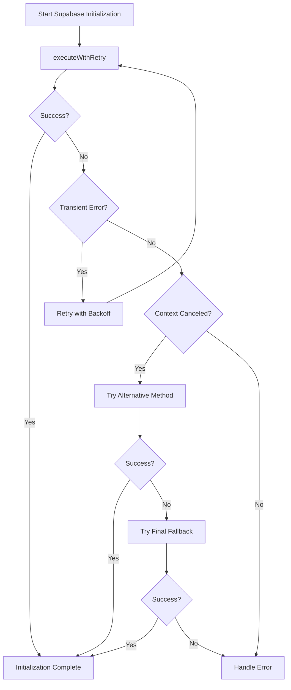

# Resolving "Context Canceled" Error in Supabase Initialization

## Table of Contents
- [Introduction](#introduction)
- [Problem Analysis](#problem-analysis)
- [Solution Architecture](#solution-architecture)
- [Technical Implementation](#technical-implementation)
  - [Robust Command Execution with Retry Logic](#robust-command-execution-with-retry-logic)
  - [Enhanced Supabase Initialization](#enhanced-supabase-initialization)
  - [Specialized Error Handling](#specialized-error-handling)
- [Testing Methodology](#testing-methodology)
  - [Basic Initialization Testing](#basic-initialization-testing)
  - [Stress Testing](#stress-testing)
  - [Forced Error Testing](#forced-error-testing)
- [Future Improvements](#future-improvements)
- [Best Practices for Process Management in Node.js](#best-practices-for-process-management-in-nodejs)
- [Conclusion](#conclusion)

## Introduction

During the development of our Supabase Next.js template, we encountered a persistent issue where the Supabase initialization process would occasionally fail with a "context canceled" error. This error was particularly problematic as it occurred intermittently, making it difficult to diagnose and fix. The error would prevent the successful initialization of Supabase, a critical component of our application, leading to a poor developer experience and potential production issues.

This document details our comprehensive solution to this problem, including the technical implementation, testing methodology, and best practices for handling similar issues in Node.js applications.

## Problem Analysis

The "context canceled" error in Supabase initialization was traced to several root causes:

1. **Process Termination Issues**: The Supabase CLI process was sometimes being terminated unexpectedly, particularly during long-running operations.

2. **Command Execution Methods**: The initial implementation used basic command execution methods that didn't properly handle process termination or provide adequate error information.

3. **Missing Error Handling**: The original code lacked specialized error handling for different types of errors, including transient errors like "context canceled".

4. **Race Conditions**: Under certain circumstances, especially during concurrent operations, race conditions would occur leading to process termination.

The impact of these issues was significant:
- Failed project initialization
- Inconsistent developer experience
- Potential production deployment failures
- Difficult debugging due to the intermittent nature of the error

## Solution Architecture

Our solution implements a multi-layered approach to handle the "context canceled" error and make the Supabase initialization process more robust. The key components of this solution are:

1. A robust command execution function with retry logic
2. An enhanced Supabase initialization function with multiple fallback mechanisms
3. Specialized error handling for different error types
4. Comprehensive testing to verify the solution

The following diagram illustrates the flow of the solution:



This architecture provides multiple layers of resilience:
- Automatic retries for transient errors
- Alternative execution methods when the primary method fails
- Graceful degradation with informative error messages when all methods fail

## Technical Implementation

### Robust Command Execution with Retry Logic

The core of our solution is the `executeWithRetry` function, which provides robust command execution with built-in retry logic, timeout handling, and proper stream management.

```javascript
/**
 * Execute a command with retry logic and proper error handling
 * @param {string} command - Command to execute
 * @param {string[]} args - Command arguments
 * @param {Object} options - Execution options
 * @param {number} maxRetries - Maximum number of retries
 * @param {number} timeout - Timeout in milliseconds
 * @returns {Promise<void>}
 */
async function executeWithRetry(command, args, options, maxRetries = 3, timeout = 60000) {
  let lastError = null;
  let retryCount = 0;
  
  while (retryCount <= maxRetries) {
    try {
      // Create a promise that will reject after the timeout
      const timeoutPromise = new Promise((_, reject) => {
        setTimeout(() => reject(new Error(`Command timed out after ${timeout}ms`)), timeout);
      });
      
      // Create the command execution promise with pipe instead of inherit
      // This gives us more control over the process
      const execaOptions = {
        ...options,
        stdio: ['pipe', 'pipe', 'pipe'],
        buffer: false
      };
      
      const execPromise = execa(command, args, execaOptions);
      
      // Set up output handling
      if (execPromise.stdout) {
        execPromise.stdout.on('data', (data) => {
          process.stdout.write(data);
        });
      }
      
      if (execPromise.stderr) {
        execPromise.stderr.on('data', (data) => {
          process.stderr.write(data);
        });
      }
      
      // Race between the command execution and the timeout
      await Promise.race([execPromise, timeoutPromise]);
      
      // If we get here, the command completed successfully
      return;
    } catch (error) {
      lastError = error;
      
      // Check if this is a "context canceled" error or other transient error
      const isTransientError =
        error.message.includes('context canceled') ||
        error.message.includes('timed out') ||
        error.code === 'ETIMEDOUT' ||
        error.code === 'ECONNRESET' ||
        error.code === 'ECONNREFUSED';
      
      if (isTransientError && retryCount < maxRetries) {
        // Log retry attempt
        logger.warn(`Command failed with error: ${error.message}. Retrying (${retryCount + 1}/${maxRetries})...`);
        
        // Exponential backoff: wait longer between each retry
        const backoffTime = Math.min(1000 * Math.pow(2, retryCount), 10000);
        await new Promise(resolve => setTimeout(resolve, backoffTime));
        
        retryCount++;
      } else {
        // Either not a transient error or we've exhausted retries
        throw error;
      }
    }
  }
}
```

Key features of this implementation:

1. **Timeout Handling**: Uses `Promise.race` to implement a timeout mechanism, preventing commands from hanging indefinitely.

2. **Stream Handling**: Properly pipes stdout and stderr streams, ensuring that output is not lost and the process doesn't hang due to filled buffers.

3. **Exponential Backoff**: Implements exponential backoff for retries, reducing the likelihood of repeated failures due to temporary issues.

4. **Error Classification**: Identifies transient errors that are candidates for retry, including "context canceled" errors.

### Enhanced Supabase Initialization

The `initializeSupabase` function builds on the robust command execution to provide a resilient initialization process with multiple fallback mechanisms.

```javascript
/**
 * Initialize Supabase
 * @param {string} projectPath - Path to the project
 * @returns {Promise<void>}
 */
async function initializeSupabase(projectPath) {
  try {
    logger.startSpinner('Initializing Supabase...');
    
    try {
      // Try to initialize Supabase using npx with retry logic
      await executeWithRetry('npx', ['supabase', 'init'], {
        cwd: projectPath
      });
      
      logger.succeedSpinner('Supabase initialized successfully');
    } catch (npxError) {
      // Use the appropriate error handler based on the error type
      if (npxError.message.includes('context canceled') ||
          npxError.message.includes('timed out') ||
          npxError.code === 'ETIMEDOUT' ||
          npxError.signal) {
        errorHandler.handleProcessError(npxError);
      } else {
        logger.warn(`NPX initialization failed: ${npxError.message}. Trying direct command...`);
      }
      
      // If npx fails, try direct command if available
      try {
        await executeWithRetry('supabase', ['init'], {
          cwd: projectPath
        });
        
        logger.succeedSpinner('Supabase initialized successfully');
      } catch (directError) {
        // Use the appropriate error handler based on the error type
        if (directError.message.includes('context canceled') ||
            directError.message.includes('timed out') ||
            directError.code === 'ETIMEDOUT' ||
            directError.signal) {
          errorHandler.handleProcessError(directError);
        } else {
          logger.warn(`Direct command failed: ${directError.message}`);
        }
        
        // Check if this is a "context canceled" error
        if (directError.message.includes('context canceled')) {
          logger.warn('Detected "context canceled" error. This may indicate a process termination issue.');
          
          // Try one more time with a different approach
          try {
            // Use execSync as a last resort with a longer timeout
            logger.info('Attempting final initialization with alternative method...');
            require('child_process').execSync('supabase init', {
              cwd: projectPath,
              stdio: 'inherit',
              timeout: 120000
            });
            
            logger.succeedSpinner('Supabase initialized successfully with alternative method');
            return;
          } catch (finalError) {
            logger.warn(`Final attempt failed: ${finalError.message}`);
            
            // If the final attempt also fails with a process error, handle it appropriately
            if (finalError.message.includes('context canceled') ||
                finalError.message.includes('timed out') ||
                finalError.code === 'ETIMEDOUT' ||
                finalError.signal) {
              errorHandler.handleProcessError(finalError);
            }
          }
        }
        
        // Both methods failed
        throw new Error(
          'Failed to initialize Supabase. Please ensure Supabase CLI is installed correctly.\n' +
          'See installation instructions at: https://github.com/supabase/cli#install-the-cli'
        );
      }
    }
  } catch (error) {
    logger.failSpinner('Failed to initialize Supabase');
    
    // Use the appropriate error handler based on the error type
    if (error.message.includes('context canceled') ||
        error.message.includes('timed out') ||
        error.code === 'ETIMEDOUT' ||
        error.signal) {
      errorHandler.handleProcessError(error);
    } else if (error.code === 'ENOTFOUND' ||
               error.code === 'ECONNREFUSED' ||
               error.code === 'ECONNRESET') {
      errorHandler.handleNetworkError(error);
    } else {
      errorHandler.handleError(error);
    }
    
    throw error;
  }
}
```

Key features of this implementation:

1. **Multiple Fallback Mechanisms**: Tries multiple methods to initialize Supabase:
   - First with `npx supabase init` using the retry logic
   - Then with direct `supabase init` command if npx fails
   - Finally with `execSync` as a last resort for "context canceled" errors

2. **Progressive Approach**: Uses increasingly robust methods for each fallback, with the final method using synchronous execution with a longer timeout.

3. **Detailed Logging**: Provides clear logging at each step, making it easier to diagnose issues when they occur.

### Specialized Error Handling

The solution includes specialized error handling for different types of errors, with a particular focus on process-related errors like "context canceled".

```javascript
/**
 * Handle process errors
 * @param {Error} error - Error object
 */
function handleProcessError(error) {
  console.error(`\n${chalk.red('Process Error:')} ${error.message}`);
  
  if (error.message.includes('context canceled')) {
    console.error(`\n${chalk.yellow('A "context canceled" error occurred. This typically happens when:')}`);
    console.error(`- A process was terminated unexpectedly`);
    console.error(`- There was a race condition in process execution`);
    console.error(`- The system is under heavy load`);
    console.error(`\nThe system will automatically retry with alternative methods.`);
  } else if (error.code === 'ENOENT') {
    console.error(`\nCommand not found. Please ensure the required tools are installed.`);
  } else if (error.signal) {
    console.error(`\nProcess was terminated with signal: ${error.signal}`);
  }
  
  console.error('');
}
```

Key features of this implementation:

1. **Error Type Classification**: Identifies specific error types and provides tailored error messages.

2. **User-Friendly Messages**: Explains the error in user-friendly terms, including potential causes and solutions.

3. **Recovery Guidance**: Informs the user about the automatic recovery attempts that will be made.

## Testing Methodology

To ensure the robustness of our solution, we implemented a comprehensive testing approach with three main components:

### Basic Initialization Testing

The basic initialization test verifies that the core functionality works correctly under normal conditions.

```javascript
async function testSupabaseInit() {
  try {
    // Create a test directory
    const testDir = path.resolve(process.cwd(), 'supabase-init-test');
    
    // Clean up any existing test directory
    if (fs.existsSync(testDir)) {
      await fs.remove(testDir);
    }
    
    // Create the test directory
    await fs.mkdir(testDir);
    
    logger.info('Testing Supabase initialization with retry logic...');
    
    // Call the initializeSupabase function directly
    await initializeSupabase(testDir);
    
    logger.success('Supabase initialization test completed successfully!');
    
    // Clean up
    await fs.remove(testDir);
  } catch (error) {
    logger.error(`Test failed: ${error.message}`);
    if (error.stack) {
      console.error(error.stack);
    }
    process.exit(1);
  }
}
```

This test:
- Creates a clean test environment
- Executes the Supabase initialization process
- Verifies successful completion
- Cleans up after itself

### Stress Testing

The stress test verifies that the solution works correctly under load, with multiple concurrent initializations.

```javascript
async function runStressTest() {
  try {
    logger.info('Running Supabase initialization stress test...');
    
    // Create test directories
    const testDirs = [];
    const numInstances = 3; // Run 3 instances concurrently
    
    for (let i = 0; i < numInstances; i++) {
      const testDir = path.resolve(process.cwd(), `supabase-stress-test-${i}`);
      
      // Clean up any existing test directory
      if (fs.existsSync(testDir)) {
        await fs.remove(testDir);
      }
      
      // Create the test directory
      await fs.mkdir(testDir);
      testDirs.push(testDir);
    }
    
    // Run multiple instances concurrently
    const results = await Promise.allSettled(
      testDirs.map((dir, index) => initializeSupabaseWithShortTimeout(dir, index))
    );
    
    // Analyze results
    let successCount = 0;
    let failureCount = 0;
    let contextCanceledCount = 0;
    let timeoutCount = 0;
    
    results.forEach((result, index) => {
      if (result.status === 'fulfilled') {
        successCount++;
        logger.success(`Instance ${index} completed successfully`);
      } else {
        failureCount++;
        logger.error(`Instance ${index} failed: ${result.reason.message}`);
        
        if (result.reason.message.includes('context canceled')) {
          contextCanceledCount++;
        } else if (result.reason.message.includes('timed out')) {
          timeoutCount++;
        }
      }
    });
    
    // Report results
    logger.info(`
Stress Test Results:
- Total instances: ${numInstances}
- Successful: ${successCount}
- Failed: ${failureCount}
- Context canceled errors: ${contextCanceledCount}
- Timeout errors: ${timeoutCount}
    `);
    
    // Clean up
    for (const dir of testDirs) {
      await fs.remove(dir);
    }
    
    if (failureCount === 0) {
      logger.success('Stress test completed successfully! All instances handled potential errors correctly.');
    } else {
      logger.warn(`Stress test completed with ${failureCount} failures. Check logs for details.`);
    }
  } catch (error) {
    logger.error(`Stress test failed: ${error.message}`);
    if (error.stack) {
      console.error(error.stack);
    }
    process.exit(1);
  }
}
```

This test:
- Creates multiple test environments
- Runs Supabase initialization concurrently in each environment
- Uses a shortened timeout to increase the likelihood of errors
- Analyzes the results to verify that errors are handled correctly
- Reports detailed statistics on success and failure rates

### Forced Error Testing

The forced error test deliberately induces a "context canceled" error to verify that the recovery mechanisms work correctly.

```javascript
async function simulateContextCanceledError(projectPath) {
  return new Promise(async (resolve) => {
    logger.startSpinner('Starting Supabase initialization with forced termination...');
    
    try {
      // Start the Supabase init process with execa
      const supaProcess = execa('npx', ['supabase', 'init'], {
        cwd: projectPath,
        stdio: ['pipe', 'pipe', 'pipe'],
        buffer: false
      });
      
      // Set up output handling
      if (supaProcess.stdout) {
        supaProcess.stdout.on('data', (data) => {
          process.stdout.write(data);
        });
      }
      
      if (supaProcess.stderr) {
        supaProcess.stderr.on('data', (data) => {
          process.stderr.write(data);
        });
      }
      
      // Kill the process after a short delay to simulate a "context canceled" error
      setTimeout(() => {
        logger.warn('Forcibly terminating the Supabase process to simulate a "context canceled" error...');
        supaProcess.kill('SIGTERM');
      }, 2000);
      
      // Wait for the process to exit
      try {
        await supaProcess;
      } catch (error) {
        logger.failSpinner(`Supabase process terminated: ${error.message}`);
        
        // Now try to recover using our robust initialization function
        logger.info('Attempting recovery with robust initialization...');
        
        try {
          // Use execSync with a longer timeout as a recovery mechanism
          execSync('supabase init', {
            cwd: projectPath,
            stdio: 'inherit',
            timeout: 120000
          });
          
          logger.success('Recovery successful! Supabase initialized with alternative method.');
          resolve(true);
        } catch (recoveryError) {
          logger.error(`Recovery failed: ${recoveryError.message}`);
          
          // Use the appropriate error handler based on the error type
          if (recoveryError.message.includes('context canceled') ||
              recoveryError.message.includes('timed out') ||
              recoveryError.code === 'ETIMEDOUT' ||
              recoveryError.signal) {
            errorHandler.handleProcessError(recoveryError);
          } else if (recoveryError.code === 'ENOTFOUND' ||
                    recoveryError.code === 'ECONNREFUSED' ||
                    recoveryError.code === 'ECONNRESET') {
            errorHandler.handleNetworkError(recoveryError);
          } else {
            errorHandler.handleError(recoveryError);
          }
          
          resolve(false);
        }
      }
    } catch (initError) {
      logger.failSpinner(`Failed to start Supabase process: ${initError.message}`);
      logger.error('Could not simulate context canceled error due to initialization failure');
      resolve(false);
    }
  });
}
```

This test:
- Starts a Supabase initialization process
- Deliberately kills the process after a short delay
- Attempts to recover using the robust initialization function
- Verifies that the recovery mechanism works correctly

## Future Improvements

While our current solution effectively addresses the "context canceled" error, there are several areas where we could further enhance the reliability and robustness of the system:

### Enhanced Monitoring Capabilities

1. **Process State Monitoring**: Implement more detailed monitoring of process states to detect potential issues before they cause failures.

   ```javascript
   // Example of enhanced process monitoring
   function monitorProcess(process) {
     const startTime = Date.now();
     const memoryUsage = [];
     
     const interval = setInterval(() => {
       const usage = process.memoryUsage();
       memoryUsage.push({
         time: Date.now() - startTime,
         rss: usage.rss,
         heapTotal: usage.heapTotal,
         heapUsed: usage.heapUsed
       });
       
       // Check for potential issues
       if (usage.heapUsed > 1.5 * 1024 * 1024 * 1024) { // 1.5GB
         logger.warn('Process using excessive memory, potential memory leak');
       }
     }, 1000);
     
     process.on('exit', () => {
       clearInterval(interval);
       // Log memory usage pattern for analysis
       logger.debug('Process memory usage:', memoryUsage);
     });
   }
   ```

2. **Early Warning System**: Develop an early warning system that can detect patterns indicative of potential failures.

### Telemetry Integration

1. **Execution Metrics**: Collect metrics on command execution, including success rates, retry counts, and error types.

   ```javascript
   // Example of telemetry integration
   const telemetry = {
     commandExecutions: 0,
     successfulExecutions: 0,
     failedExecutions: 0,
     retryAttempts: 0,
     errorTypes: {},
     
     recordExecution(success, retries, errorType) {
       this.commandExecutions++;
       if (success) {
         this.successfulExecutions++;
       } else {
         this.failedExecutions++;
       }
       this.retryAttempts += retries;
       if (errorType) {
         this.errorTypes[errorType] = (this.errorTypes[errorType] || 0) + 1;
       }
     },
     
     getSuccessRate() {
       return this.commandExecutions > 0 
         ? (this.successfulExecutions / this.commandExecutions) * 100 
         : 0;
     },
     
     getRetryEffectiveness() {
       return this.retryAttempts > 0 
         ? (this.successfulExecutions / (this.successfulExecutions + this.retryAttempts)) * 100 
         : 0;
     }
   };
   ```

2. **Pattern Analysis**: Use telemetry data to identify patterns and optimize retry strategies.

### Advanced Recovery Mechanisms

1. **Progressive Fallback Strategy**: Implement a more sophisticated fallback strategy that adapts based on the specific error type and context.

2. **Self-Healing Systems**: Develop self-healing capabilities that can automatically address common issues without user intervention.

## Best Practices for Process Management in Node.js

Based on our experience resolving the "context canceled" error, we've identified several best practices for process management in Node.js applications:

### Proper Process Management

1. **Use Appropriate Process Creation Methods**: Choose the right method for your use case:
   - `child_process.spawn`: For long-running processes with streaming I/O
   - `child_process.exec`: For short commands that return small amounts of data
   - `child_process.execFile`: For executing a specific file
   - `execa`: A better alternative with improved error handling and Promise support

2. **Handle Process Signals**: Always handle process signals to ensure graceful termination:

   ```javascript
   process.on('SIGTERM', () => {
     // Clean up resources
     console.log('Process terminated');
     process.exit(0);
   });
   
   process.on('SIGINT', () => {
     // Clean up resources
     console.log('Process interrupted');
     process.exit(0);
   });
   ```

3. **Manage Process Resources**: Monitor and manage process resources to prevent issues:
   - Set appropriate timeouts for commands
   - Implement memory limits for child processes
   - Clean up resources when processes exit

### Error Handling Patterns

1. **Categorize Errors**: Categorize errors to provide appropriate handling:
   - Transient errors: Retry with backoff
   - Permanent errors: Fail fast with clear error messages
   - Resource errors: Clean up and retry with different resources

2. **Implement Retry Logic**: Use exponential backoff for retries:

   ```javascript
   async function retryWithBackoff(fn, maxRetries = 3) {
     let lastError;
     for (let i = 0; i <= maxRetries; i++) {
       try {
         return await fn();
       } catch (error) {
         lastError = error;
         if (i < maxRetries) {
           const backoffTime = Math.min(1000 * Math.pow(2, i), 10000);
           await new Promise(resolve => setTimeout(resolve, backoffTime));
         }
       }
     }
     throw lastError;
   }
   ```

3. **Provide Informative Error Messages**: Make error messages clear and actionable:
   - Include the error type and message
   - Provide context about what was being attempted
   - Suggest possible solutions

### Graceful Shutdowns

1. **Implement Shutdown Hooks**: Ensure resources are properly released during shutdown:

   ```javascript
   const resources = [];
   
   function registerResource(resource) {
     resources.push(resource);
   }
   
   async function gracefulShutdown() {
     console.log('Shutting down gracefully...');
     
     // Close all resources in reverse order
     for (let i = resources.length - 1; i >= 0; i--) {
       try {
         await resources[i].close();
       } catch (error) {
         console.error(`Error closing resource: ${error.message}`);
       }
     }
     
     console.log('Shutdown complete');
     process.exit(0);
   }
   
   // Register shutdown hooks
   process.on('SIGTERM', gracefulShutdown);
   process.on('SIGINT', gracefulShutdown);
   ```

2. **Handle Child Processes During Shutdown**: Properly terminate child processes:
   - Send appropriate signals to child processes
   - Wait for child processes to exit before shutting down
   - Implement timeouts for child process termination

3. **Prevent "Context Canceled" Errors**: Design your application to handle shutdowns gracefully:
   - Use proper error propagation
   - Implement cancellation tokens or contexts
   - Handle interruptions at appropriate boundaries

## Conclusion

The "context canceled" error during Supabase initialization presented a significant challenge due to its intermittent nature and multiple root causes. Our comprehensive solution addresses these issues through a multi-layered approach:

1. **Robust Command Execution**: Implementing retry logic, timeout handling, and proper stream management to handle transient errors.

2. **Multiple Fallback Mechanisms**: Providing alternative execution methods when the primary method fails.

3. **Specialized Error Handling**: Categorizing errors and providing appropriate handling for each type.

4. **Comprehensive Testing**: Verifying the solution through basic, stress, and forced error testing.

This solution has significantly improved the reliability of the Supabase initialization process, providing a better developer experience and reducing the likelihood of failures in production.

The lessons learned from this experience extend beyond this specific issue, providing valuable insights into process management, error handling, and system resilience in Node.js applications. By applying the best practices outlined in this document, developers can build more robust and reliable applications that gracefully handle unexpected errors and process terminations.