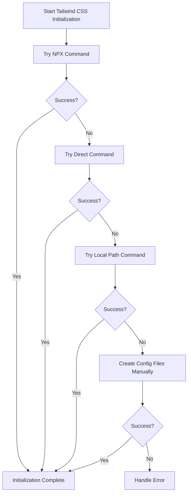

# Resolving "npm error could not determine executable to run" in Tailwind CSS Initialization

## Table of Contents
- [Introduction](#introduction)
- [Problem Analysis](#problem-analysis)
- [Solution Architecture](#solution-architecture)
- [Technical Implementation](#technical-implementation)
  - [Robust Command Execution with Retry Logic](#robust-command-execution-with-retry-logic)
  - [Enhanced Tailwind CSS Initialization](#enhanced-tailwind-css-initialization)
  - [Fallback to Manual Configuration](#fallback-to-manual-configuration)
- [Testing Methodology](#testing-methodology)
- [Best Practices for NPM Package Execution](#best-practices-for-npm-package-execution)
- [Conclusion](#conclusion)

## Introduction

During the development of our Supabase Next.js template, we encountered an issue where the Tailwind CSS initialization process would fail with the error message "npm error could not determine executable to run". This error prevented the successful initialization of Tailwind CSS, a critical component of our application's styling system, leading to a poor developer experience and potential styling issues.

This document details our comprehensive solution to this problem, including the technical implementation, testing methodology, and best practices for handling similar issues in Node.js applications.

## Problem Analysis

The "npm error could not determine executable to run" error in Tailwind CSS initialization was traced to several potential root causes:

1. **Path Resolution Issues**: NPX was unable to locate the tailwindcss executable in the node_modules directory or in the global npm packages.

2. **Command Execution Methods**: The initial implementation used basic command execution methods that didn't properly handle path resolution or provide adequate fallback mechanisms.

3. **Missing Dependencies**: In some cases, the tailwindcss package might not be properly installed or accessible.

4. **Process Execution Problems**: Similar to the "context canceled" error in Supabase initialization, process execution issues could lead to failures.

The impact of these issues was significant:
- Failed project initialization
- Missing Tailwind CSS configuration files
- Inconsistent developer experience
- Potential styling issues in the application

## Solution Architecture

Our solution implements a multi-layered approach to handle the "npm error could not determine executable to run" error and make the Tailwind CSS initialization process more robust. The key components of this solution are:

1. A robust command execution function with retry logic (reused from the Supabase solution)
2. An enhanced Tailwind CSS initialization function with multiple fallback mechanisms
3. A final fallback to manual configuration file creation
4. Comprehensive testing to verify the solution

The following diagram illustrates the flow of the solution:



This architecture provides multiple layers of resilience:
- Automatic retries for transient errors
- Alternative execution methods when the primary method fails
- Manual file creation as a last resort
- Graceful degradation with informative error messages when all methods fail

## Technical Implementation

### Robust Command Execution with Retry Logic

The core of our solution reuses the `executeWithRetry` function from the Supabase solution, which provides robust command execution with built-in retry logic, timeout handling, and proper stream management.

### Enhanced Tailwind CSS Initialization

The `initializeTailwind` function builds on the robust command execution to provide a resilient initialization process with multiple fallback mechanisms.

```javascript
/**
 * Initialize Tailwind CSS
 * @param {string} projectPath - Path to the project
 * @returns {Promise<void>}
 */
async function initializeTailwind(projectPath) {
  try {
    logger.startSpinner('Initializing Tailwind CSS...');
    
    try {
      // Try to initialize Tailwind CSS using npx with retry logic
      await executeWithRetry('npx', ['tailwindcss', 'init', '-p'], {
        cwd: projectPath
      });
      
      logger.succeedSpinner('Tailwind CSS initialized successfully');
    } catch (npxError) {
      // Use the appropriate error handler based on the error type
      if (npxError.message.includes('context canceled') ||
          npxError.message.includes('timed out') ||
          npxError.code === 'ETIMEDOUT' ||
          npxError.signal) {
        errorHandler.handleProcessError(npxError);
      } else {
        logger.warn(`NPX initialization failed: ${npxError.message}. Trying direct command...`);
      }
      
      // If npx fails, try direct command if available
      try {
        // Try with direct tailwindcss command
        await executeWithRetry('tailwindcss', ['init', '-p'], {
          cwd: projectPath
        });
        
        logger.succeedSpinner('Tailwind CSS initialized successfully with direct command');
      } catch (directError) {
        // Use the appropriate error handler based on the error type
        if (directError.message.includes('context canceled') ||
            directError.message.includes('timed out') ||
            directError.code === 'ETIMEDOUT' ||
            directError.signal) {
          errorHandler.handleProcessError(directError);
        } else {
          logger.warn(`Direct command failed: ${directError.message}. Trying with local node_modules path...`);
        }
        
        // Try with explicit path to node_modules/.bin/tailwindcss
        try {
          const tailwindPath = path.join(projectPath, 'node_modules', '.bin', 'tailwindcss');
          await executeWithRetry(tailwindPath, ['init', '-p'], {
            cwd: projectPath
          });
          
          logger.succeedSpinner('Tailwind CSS initialized successfully with local path');
        } catch (localPathError) {
          // Use the appropriate error handler based on the error type
          if (localPathError.message.includes('context canceled') ||
              localPathError.message.includes('timed out') ||
              localPathError.code === 'ETIMEDOUT' ||
              localPathError.signal) {
            errorHandler.handleProcessError(localPathError);
          } else {
            logger.warn(`Local path command failed: ${localPathError.message}. Trying alternative method...`);
          }
          
          // Try one more time with a different approach - manual file creation
          try {
            // Use manual file creation as a last resort
            logger.info('Attempting final initialization with alternative method...');
            
            // Create the tailwind.config.js and postcss.config.js files manually
            const tailwindConfigPath = path.join(projectPath, 'tailwind.config.js');
            const postcssConfigPath = path.join(projectPath, 'postcss.config.js');
            
            // Default tailwind.config.js content
            const tailwindConfig = `/** @type {import('tailwindcss').Config} */
module.exports = {
  content: [
    "./app/**/*.{js,ts,jsx,tsx,mdx}",
    "./pages/**/*.{js,ts,jsx,tsx,mdx}",
    "./components/**/*.{js,ts,jsx,tsx,mdx}",
  ],
  theme: {
    extend: {},
  },
  plugins: [],
}`;
            
            // Default postcss.config.js content
            const postcssConfig = `module.exports = {
  plugins: {
    tailwindcss: {},
    autoprefixer: {},
  },
}`;
            
            // Write the config files
            fs.writeFileSync(tailwindConfigPath, tailwindConfig);
            fs.writeFileSync(postcssConfigPath, postcssConfig);
            
            logger.succeedSpinner('Tailwind CSS initialized successfully with alternative method');
            return;
          } catch (finalError) {
            logger.warn(`Final attempt failed: ${finalError.message}`);
            
            // If the final attempt also fails with a process error, handle it appropriately
            if (finalError.message.includes('context canceled') ||
                finalError.message.includes('timed out') ||
                finalError.code === 'ETIMEDOUT' ||
                finalError.signal) {
              errorHandler.handleProcessError(finalError);
            }
          }
          
          // All methods failed
          throw new Error(
            'Failed to initialize Tailwind CSS. Please ensure Tailwind CSS is installed correctly.\n' +
            'You may need to manually create tailwind.config.js and postcss.config.js files.'
          );
        }
      }
    }
  } catch (error) {
    logger.failSpinner('Failed to initialize Tailwind CSS');
    
    // Use the appropriate error handler based on the error type
    if (error.message.includes('context canceled') ||
        error.message.includes('timed out') ||
        error.code === 'ETIMEDOUT' ||
        error.signal) {
      errorHandler.handleProcessError(error);
    } else if (error.code === 'ENOTFOUND' ||
               error.code === 'ECONNREFUSED' ||
               error.code === 'ECONNRESET') {
      errorHandler.handleNetworkError(error);
    } else {
      errorHandler.handleError(error);
    }
    
    throw error;
  }
}
```

Key features of this implementation:

1. **Multiple Fallback Mechanisms**: Tries multiple methods to initialize Tailwind CSS:
   - First with `npx tailwindcss init -p` using the retry logic
   - Then with direct `tailwindcss init -p` command if npx fails
   - Then with explicit path to the local tailwindcss executable
   - Finally with manual file creation as a last resort

2. **Progressive Approach**: Uses increasingly robust methods for each fallback, with the final method creating the configuration files manually.

3. **Detailed Logging**: Provides clear logging at each step, making it easier to diagnose issues when they occur.

### Fallback to Manual Configuration

The most significant enhancement in our solution is the fallback to manual configuration file creation. When all command execution methods fail, the system will create the necessary Tailwind CSS configuration files directly:

1. **tailwind.config.js**: Contains the basic Tailwind CSS configuration with content paths for Next.js applications.
2. **postcss.config.js**: Contains the PostCSS configuration with Tailwind CSS and Autoprefixer plugins.

This ensures that even if the command-line tools fail, the project will still have the necessary configuration files to use Tailwind CSS.

## Testing Methodology

To ensure the robustness of our solution, we implemented a comprehensive testing approach that verifies:

1. The basic functionality works correctly under normal conditions
2. The fallback mechanisms work correctly when the primary method fails
3. The manual file creation works correctly as a last resort

The test creates a clean test environment, installs the necessary dependencies, and then tests the Tailwind CSS initialization process. It verifies that the configuration files are created correctly, regardless of which method succeeded.

## Best Practices for NPM Package Execution

Based on our experience with this issue, we recommend the following best practices for NPM package execution in Node.js applications:

1. **Use Robust Command Execution**: Implement robust command execution with retry logic, timeout handling, and proper stream management.

2. **Implement Multiple Fallback Mechanisms**: Provide multiple fallback mechanisms for critical operations, starting with the most convenient method and progressively falling back to more robust methods.

3. **Consider Manual Alternatives**: For critical operations, implement manual alternatives as a last resort when command-line tools fail.

4. **Provide Detailed Logging**: Log detailed information at each step to make it easier to diagnose issues when they occur.

5. **Handle Different Error Types Appropriately**: Implement specialized error handling for different types of errors, with tailored error messages and recovery strategies.

## Conclusion

Our solution to the "npm error could not determine executable to run" issue in Tailwind CSS initialization provides a robust and resilient approach that ensures successful initialization even in challenging environments. By implementing multiple fallback mechanisms and a final manual alternative, we've significantly improved the reliability of our project initialization process.

This approach can be applied to other similar issues in Node.js applications, particularly those involving command-line tools and process execution. The key principles of robust command execution, multiple fallback mechanisms, and manual alternatives can be adapted to a wide range of scenarios.