# Documentation Plan: Robust Node.js CLI Application Initialization Solutions

## 1. Document Structure

```mermaid
flowchart TD
    A[Unified Documentation] --> B[Introduction]
    A --> C[Problem Analysis]
    A --> D[Common Patterns & Approaches]
    A --> E[Technical Implementation]
    A --> F[Testing Methodology]
    A --> G[Future Improvements]
    A --> H[Best Practices]
    A --> I[Conclusion]
    
    C --> C1[Supabase Issue]
    C --> C2[Tailwind Issue]
    
    D --> D1[Multi-layered Fallback Strategy]
    D --> D2[Robust Command Execution]
    D --> D3[Specialized Error Handling]
    D --> D4[Progressive Approach]
    
    E --> E1[Supabase Solution]
    E --> E2[Tailwind Solution]
    
    F --> F1[Basic Testing]
    F --> F2[Stress Testing]
    F --> F3[Forced Error Testing]
    
    G --> G1[Unified Error Handling]
    G --> G2[Dependency Management]
    G --> G3[Process Monitoring]
    
    H --> H1[Command Execution]
    H --> H2[Error Recovery]
    H --> H3[User Feedback]
```

## 2. Detailed Section Breakdown

### 2.1 Introduction
- Brief overview of the project and its purpose
- Summary of the two issues addressed
- Importance of robust initialization processes in Node.js CLI applications
- Document goals and target audience

### 2.2 Problem Analysis
- **Supabase Initialization "Context Canceled" Error**
  - Root causes (process termination, command execution methods, missing error handling, race conditions)
  - Impact on project initialization
  - Challenges in diagnosing and fixing

- **Tailwind CSS Initialization "npm error could not determine executable to run"**
  - Root causes (path resolution issues, command execution methods, missing dependencies, process execution problems)
  - Impact on project initialization
  - Challenges in diagnosing and fixing

### 2.3 Common Patterns and Approaches (Emphasized Section)
- **Multi-layered Fallback Strategy**
  - Description: Implementing multiple methods to accomplish the same task, with automatic fallback when primary methods fail
  - Benefits: Increased resilience, graceful degradation, improved user experience
  - Implementation pattern with simplified code example
  - Visualization of the fallback flow

- **Robust Command Execution**
  - Description: Enhanced command execution with retry logic, timeout handling, and proper stream management
  - Benefits: Handles transient errors, prevents hanging processes, provides detailed error information
  - Implementation pattern with simplified code example from `executeWithRetry`
  - Key components: timeout handling, stream handling, exponential backoff

- **Specialized Error Handling**
  - Description: Tailored error handling for different types of errors
  - Benefits: Improved user experience, better diagnostics, appropriate recovery strategies
  - Implementation pattern with simplified code example from error handler
  - Key components: error classification, user-friendly messages, recovery guidance

- **Progressive Approach**
  - Description: Using increasingly robust methods for each fallback
  - Benefits: Balance between convenience and reliability, optimal resource usage
  - Implementation pattern with simplified code examples from both solutions
  - Key components: convenience-first approach, progressive fallbacks, manual alternatives

### 2.4 Technical Implementation
- **Supabase Initialization Solution**
  - `executeWithRetry` function (key code example)
  - `initializeSupabase` function with fallback mechanisms (key code example)
  - `handleProcessError` function for specialized error handling

- **Tailwind CSS Initialization Solution**
  - `initializeTailwind` function with fallback mechanisms (key code example)
  - Manual file creation as a last resort (key code example)
  - Integration with the error handling system

### 2.5 Testing Methodology
- **Basic Initialization Testing**
  - Purpose and approach
  - Key components of the test

- **Stress Testing**
  - Purpose and approach
  - Key components of the test

- **Forced Error Testing**
  - Purpose and approach
  - Key components of the test

### 2.6 Future Improvements
- **Unified Error Handling System**
  - Centralized error handling with standardized error types
  - Enhanced error recovery strategies
  - Improved user feedback

- **Enhanced Dependency Management**
  - Proactive dependency checking
  - Automatic dependency installation
  - Version compatibility management

- **Process Monitoring and Management**
  - Advanced process monitoring
  - Graceful termination handling
  - Resource usage optimization

### 2.7 Best Practices for Node.js CLI Applications
- **Robust Command Execution**
  - Use proper stream handling
  - Implement timeout mechanisms
  - Handle process termination gracefully

- **Error Recovery Strategies**
  - Implement retry logic with exponential backoff
  - Provide multiple fallback mechanisms
  - Create manual alternatives for critical operations

- **User Feedback and Guidance**
  - Provide clear error messages
  - Offer recovery suggestions
  - Log detailed information for debugging

### 2.8 Conclusion
- Summary of the solutions and their benefits
- Key takeaways for Node.js CLI application development
- Broader applications of the patterns and approaches

## 3. Implementation Approach

1. **Research and Information Gathering** (Completed)
   - Review existing solution documentation
   - Examine implementation code
   - Understand testing methodology

2. **Documentation Structure Creation**
   - Create the document outline based on the plan
   - Define section headers and subheaders
   - Establish consistent formatting

3. **Content Development**
   - Write the introduction and problem analysis sections
   - Develop the common patterns and approaches section with emphasis
   - Document the technical implementation with focused code examples
   - Describe the testing methodology
   - Provide recommendations for future improvements
   - Outline best practices for Node.js CLI applications
   - Write the conclusion

4. **Visual Elements**
   - Create diagrams to illustrate the fallback strategies
   - Develop flowcharts for the error handling process
   - Include code examples with syntax highlighting

5. **Review and Refinement**
   - Ensure consistency across sections
   - Verify technical accuracy
   - Enhance readability and clarity

6. **Finalization**
   - Format the document according to Markdown standards
   - Add table of contents
   - Include references and resources

## 4. Key Focus Areas

1. **Common Patterns and Approaches**: This section will be the most detailed and emphasized, highlighting the reusable strategies that can be applied to other Node.js CLI applications.

2. **Code Examples**: Include focused code snippets that illustrate the core patterns and approaches, particularly:
   - The `executeWithRetry` function
   - The fallback mechanisms in both solutions
   - The specialized error handling
   - The manual file creation as a last resort

3. **Visual Representations**: Use diagrams to illustrate the fallback strategies, error handling flow, and the relationships between different components of the solutions.